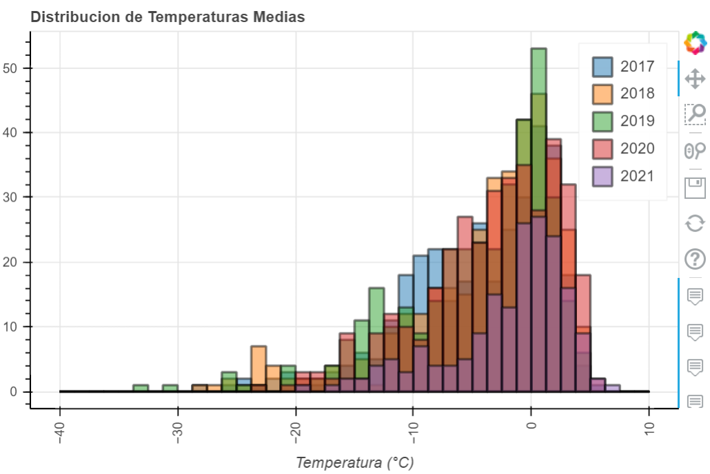

# Exploración de datos Meteorológicos

## Base Antártica San Martín 

 

Se localiza en el islote Barry, a los 68º07'S y 67º08'W, en el corazón de la Península Antártica. El Islote Barry (Caleta Sanaviron, Paso Mottet) forma parte de los Islotes Debenham (Bahía Margarita, Costa Fallieres), situados próximos al Mar de Bellinhaussen. Inaugurada el 21 de marzo de 1951 por el entonces Coronel Hernán Pujato fue la base más austral del mundo, situada al sur del Círculo Polar Antártico. 
La Base cuenta con el Laboratorio San Martín (LASAN) del Instituto Antártico Argentino (IAA) y una estación meteorológica. Entre las actividades científicas se desarrollan diversos estudios del campo magnético, el comportamiento de la ionosfera y de silbidos atmosféricos; así como también análisis de ruidos cósmicos y estudios glaciológicos, en convenio con Alemania y el IAA.

## Clima 
La temperatura es variable. En invierno llega a los -37ºC y en verano a los 8ºC. El mar se congela desde los meses de junio a noviembre; su espesor promedio es de 1,20 metros. La precipitación anual promedio oscila en los 500 milímetros; en los últimos años, también se han registrado algunas lluvias.
## Datos  
El Servicio Meteorológico Nacional registra diariamente los parámetros climáticos mas relevantes. Mensualmente se genera un resumen de los datos en una planilla de Excel con un formato bien definido que llevan el nombre de "Planillas CLIMAT". Sobre estas planillas se realizará el análisis.  

  

Las mismas estan almacenadas en un directorio que contiene una carpeta por cada año de registro y dentro de las misma una planilla CLIMAT por cada mes.  

  

## Análisis de Datos  
Para el análisis de datos se utilizó un [Notebook de Jupyter](https://github.com/RodrigoAzpilcueta/WeatherDataExploration/blob/main/BASM_WeatherData.ipynb) y los siguientes módulos de Python:
* Openpyxl para importar los datos de los archivos .xlsx.
* Numpy y Pandas para la manipulación, limpieza y análisis de datos.
* Bokeh, Pandas_Bokey y Matplotlib para graficar.
* Scipy para funciones estadisticas
  

# Extracción de datos  
Se automatizo el proceso de extracción de datos con el modulo Openpyxl, se extrajo de cada una de las planillas CLIMAT los siguientes datos:
* Dia, Mes, Año
* Presion atmosféroca a nivel de la estación para los horas 00,06,12,18.
* Presion atmosféroca a nivel del mar para los horas 00,06,12,18.
* Temperatura medida para los horas 00,06,12,18.
* Temperatura máxima del dia.
* Temperatura mínima del dia.
* Tensión del vapor para los horas 00,06,12,18.
* Precipitaciones en milimetros.

Los datos se almacenaron en un DataFrame donde se corrigieron datos erroneos y faltantes. Se agrego la Feature TMean que corresponde a la temperatura media diaria la cual se calcula en base al promedio de las cuatro temperaturas medidas.  
# Graficos  
Se realizó con Bokeh un grafico de barras interactivo de las precipitaciones mensuales y anuales.  

  

  

De la misma forma con Bokeh se realizó los graficos interactivos de temperaturas medias, máximas y minimas  (diarias y mensuales).  

  

  

Se agregó un histograma interactivo de temperaturas medias por años para analizar su distribución.  

  

Del gráfico anterior se deduce que la distribución de temperaturas medias se puede aproximar para todos los años a una distribución del tipo Rayleigh. 

 

